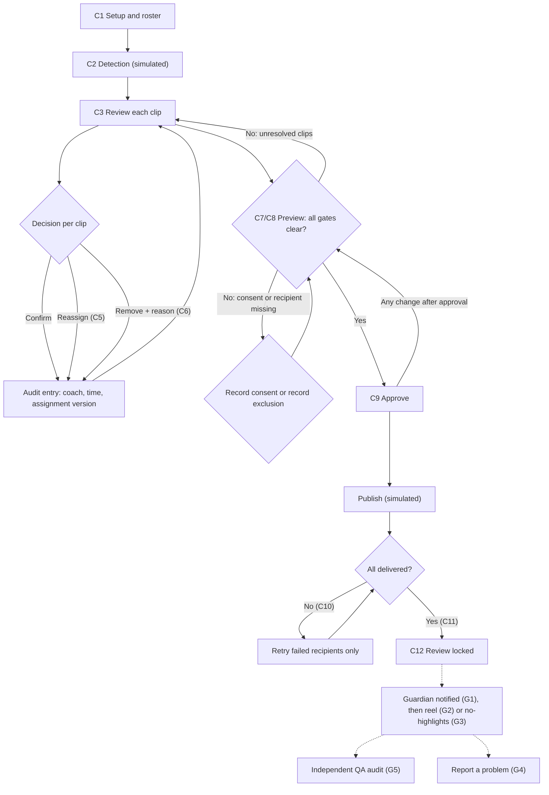

# Wireframes v2: the coach review-and-publish flow

Wireframes designed from scratch from the working prototype, with a focus on **states** (blocked, error, empty, failed, locked), not just the happy path.

| Deliverable | Where | Status |
|---|---|---|
| Coach flow, 13 screens at 375px, with numbered annotations tied to requirements | [Figma file](https://www.figma.com/design/ldS1cRoozKTRGsuvzqhAWZ), page "Wireframes · Coach" | **Built** |
| Design tokens (30 variables) and ~25 components | Same Figma file, page 1 | **Built** |
| Guardian and QA screens (5) | [`guardian-wireframes.html`](guardian-wireframes.html) and [`guardian/`](guardian) images | **Built** (HTML, same low-fi style) |
| User flow | Mermaid diagram below | **Built** |
| Figma brief page, Figma flow page, guardian page | Figma pages 1 and 3 | **Not finished** (see "What is left in Figma") |
| High-fidelity reference | The working prototype, `site/index.html`, plus [`docs/screenshots/`](../../docs/screenshots) | Exists |

## Problem frame
- **User:** a volunteer youth-sports coach with limited time, reviewing a match's clips on a phone, who must not send one child's clip to another child's parent.
- **Job:** confirm who is in each AI-proposed clip, then send every family only their own child's clips.
- **The risk the design must prevent:** a confident but wrong AI proposal that a tired coach confirms by reflex, then a wrong-child delivery. The case study cites four wrong-child tickets across three clubs (similar jersey numbers) [Source: assessment brief, not re-verified].
- **Constraint:** the prototype uses fictional data and simulated AI and delivery. Every screen says so.

## Design principles
1. **Evidence next to the decision.** The frame, the observed jersey and the AI proposal sit side by side.
2. **Confidence is a hint, never a shortcut.** No bulk confirm, no auto-skip, no "high confidence" fast lane.
3. **Every block says why.** Blockers list all reasons at once and name the child or count.
4. **Nothing disappears silently.** Exclusions, zero-highlight children and withheld clips stay visible.
5. **Honest wording.** "Simulated", "reviewed by your coach", never "100% correct".
6. **Reversible until publish, locked after.** The boundary is stated before the coach approves.
7. **Mobile first.** One column, 40px+ touch targets, text never the only carrier of state.

## User flow

Solid lines are in the prototype. Dotted lines are from the spec only.

## Screen inventory

| ID | Screen | What it proves | Key requirements |
|---|---|---|---|
| C1 | Setup and roster | Consent gaps visible before AI runs; roster confirmed first | FR-1, 2, 3, 18, 24 |
| C2 | Detection running | Progress is explicit and labelled simulated | FR-19, 24 |
| C3 | Review queue | Every clip starts unresolved; no bulk action | FR-4 to 9, 6 |
| C4 | Clip focus, 14-vs-4 | **Proposed** jersey-mismatch warning and "confidence is a hint" | FR-4, 8 (proposal) |
| C5 / C5b | Reassign, normal and blocked | Note always matches the chosen child | FR-8, 10 |
| C6 | Remove | A reason is truly mandatory | FR-9, 11 |
| C7 | Publish blocked | All blockers at once; two explicit consent paths | FR-16, 17, 18, 21 |
| C8 | Ready to approve | Exclusions, zero-highlight and thumbnails shown honestly | FR-12, 13, 15, 16 |
| C9 | Approved | Approval resets on any change | FR-20, 21 |
| C10 | Delivery with a failure | Targeted retry, no duplicates | FR-22, 23, 24 |
| C11 | Delivery complete | Modest wording, no accuracy claim | FR-24 |
| C12 | Locked after publish | Decisions cannot drift from what was sent. Open question flagged | FR-20 |
| G1 to G5 | Guardian and QA | Notification, reel, empty state, report a problem, audit | PRD sections 4, 5, 12, 14 |

## Decisions worth explaining
- **Reassign is one dialog, not remove-then-choose.** It shows the evidence and writes both the old and the new child to the audit trail. (A competing flow documented in the Veo teardown clears the old player first, then chooses.)
- **The note follows the child.** A prototype bug showed Liam in the note with Maya selected. The wireframe makes the safe behaviour explicit (C5, C5b).
- **Removal reason starts blank.** The old default made "mandatory" meaningless (C6).
- **Thumbnails show the jersey in the clip.** A wrong-child confirm can no longer look right (C8).
- **Excluded children stay on the page** with the reason and the number of withheld clips (C8).
- **Lock after publish**, with an explicit open question about corrections (C12).
- **Proposals are magenta and labelled.** C4, G1, G3, G4 and G5 carry proposals that need a product decision. They are not hidden in the main design.

## Usability test plan (proposed, not run)
**Goal:** find out whether coaches actually catch a confident wrong proposal.
- **Who:** 5 volunteer or club coaches, on their own phones. Remote or in person.
- **Tasks:** (1) Review a match of 11 clips. (2) Fix anything that looks wrong. (3) Get the batch published. (4) After publish, find out what happened to one family.
- **The planted trap:** include the 14-vs-4 clip at 94% confidence. Record whether each coach confirms it, catches it, or reassigns it.
- **Measures:** whether the trap was caught (with and without the C4 warning, in two groups), time to review, hesitation points, and what each coach says the blocked banner means. No success thresholds are claimed. Five people show problems, not rates.
- **Questions:** What would make you trust this enough to use it every weekend? Where did you want a "Can't tell" button? What did "simulated" make you think?
- **Ethics:** use fictional children and fictional footage only.

## Accessibility checks to run
Colour is never the only signal (icons and words accompany it). Touch targets are 40px or more. Text contrast needs a formal check in the final colours. Screen-reader order and focus for the modals (C5, C6) are not yet specified.

## What is left in Figma
The Starter plan with a View seat allows 20 MCP tool calls per month, and they are used up. To finish:
1. **Page 1:** add the project brief, the user flow (redraw the Mermaid diagram above in FigJam or on the canvas) and a title above the component gallery.
2. **Page 3:** paste or rebuild the guardian screens from the HTML (G1 to G5).
3. **Polish by hand:** shorten the C9 fail-mode button label to "Fail mode: ON"; select all annotation markers and set X to 1 so they sit in the left gutter; check C10's log markers.
4. **Prototype wiring:** add click-through links between C1 to C12 in Figma's Prototype tab.
