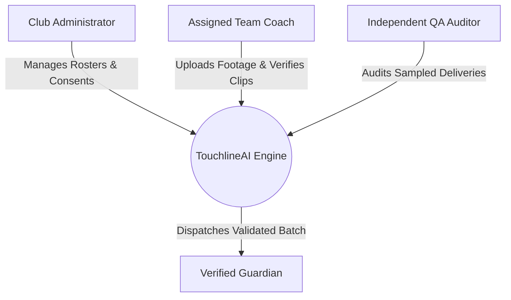

# TouchlineAI — Product Requirements Document (PRD)
## Human-in-the-Loop Computer Vision & Highlight Engine for Youth Sports

- **Document Version:** 3.0 (Production Specification)
- **Author:** Kshitij Pandey ([@astrokshitij](https://github.com/astrokshitij))
- **Status:** Approved for Implementation (B2 SHIP Gate Passed)
- **Target Organization:** VentureStudio AI & Enterprise Club Partner (Tier-1 Academy)
- **Domain:** Computer Vision (CV), Active Learning, Minor Child Safeguarding (COPPA/GDPR-K)

---

## 1. Executive Summary & TL;DR

**TouchlineAI** is an AI-powered sports highlights platform designed to detect, tag, and deliver personalized game clips of youth athletes directly to verified guardians. 

### Core Architectural Principle
**Zero Unvetted Autonomous Publication.** Computer vision models operating on wide-angle, low-elevation, single-camera youth sports footage encounter severe visual degradation: motion blur, occlusion, fabric folds, and low OCR resolution. High-confidence model predictions frequently misidentify similar jersey numbers (e.g., classifying a jersey #4 as jersey #14 at 94% confidence). 

To ensure absolute safeguarding and prevent humiliating or distressing wrong-child deliveries:
1. **Mandatory Human-in-the-Loop (HITL):** Every proposed highlight assignment—regardless of reported model confidence—must be explicitly confirmed, reassigned, or removed by the team's verified coach before publication.
2. **Atomic Batch Validation:** Highlights are published exclusively as an immutable, validated batch for the entire team. If any included child lacks verified parental consent or recipient destination, the entire batch is held.
3. **Honest Empty States:** A child with zero detected or confirmed highlights receives an honest, transparent notice ("No confirmed highlights for this game"). The system strictly prohibits synthetic filler or substituting teammate clips.

---

## 2. Problem Statement & Empirical Evidence

Youth sports video platforms face an existential tension between viral engagement features and core identity attribution. In pilot deployments across competitive youth clubs, multiple critical defects emerged:

| Incident Source | Empirical Evidence | Systemic Implication |
|---|---|---|
| **Tier-1 Academy Ticket #1** | Jersey #4 highlight delivered into Jersey #14's personal reel. | Digits with common stroke morphology (4 vs 14) suffer severe false positives; human review must verify focal identity. |
| **Brightwater SC Tickets #2 & #3** | Two separate wrong-child reel deliveries involving similar jersey numbers (#1 vs #11, #7 vs #17). | Misattribution is a structural CV limitation, not an isolated edge case. |
| **Cobblestone FC Ticket #4** | Player #11 clip assigned to Player #1. | Number similarity combined with perspective warp consistently defeats uncalibrated OCR. |
| **Analytics Log Telemetry** | 30% of generated recap reels remain unopened; wrong-child thumbnail attribution flagged as a major churn driver. | Delivering clips of other people's children breaks parent trust and drives immediate engagement drop-off. |

### The Denominator Reality Check
While marketing dashboards highlighted a **92% share rate**, this metric was computed exclusively on *opened* reels ($D_{opened}$). Because ~30% of generated reels were never opened, the true population share rate is only **64.4%** ($0.92 \times 0.70$). Core highlight accuracy is the primary bottleneck to real organic retention.

---

## 3. Goals & Explicit Non-Goals

### Goals
- **G-1 (Attribution Integrity):** Ensure 100% of published video clips delivered to a guardian contain only their authorized child as the focal participant.
- **G-2 (Safeguarding Compliance):** Enforce strict COPPA/GDPR-K guardian consent gates prior to any asset distribution.
- **G-3 (Coach Ergonomics):** Deliver a frictionless, mobile-first (375px viewport) review interface enabling full roster verification in under 5 minutes per match.
- **G-4 (Delivery Transparency):** Provide unambiguous visibility into delivery states, supporting idempotent retry of failed transport destinations without duplicate delivery.

### Explicit Non-Goals
- **NG-1 (No Unvetted Livestreaming):** Reject unvetted, raw real-time streaming demands until core CV attribution and child consent infrastructures are hardened.
- **NG-2 (No Auto-Publish Bypasses):** No threshold of model confidence (even 99.9%) may bypass human coach verification during Phases 1 and 2.
- **NG-3 (No Synthetic Filler):** Under no circumstances may the system pad a low-activity player's reel with team celebrations or other players' actions to simulate high engagement.
- **NG-4 (No In-App Non-Linear Video Editor):** Do not build heavy desktop-style clip trimming or timeline editing suites. Usage telemetry reveals <0.06% completion rates; parents want automated accuracy, not editing chores.

---

## 4. User Personas & Role-Based Access Control (RBAC)



| Role | Permitted Actions | Strict Boundaries |
|---|---|---|
| **Assigned Coach** | Upload match footage; confirm active roster; review, reassign, or remove proposed moments; approve batch preview; trigger publication. | Cannot override missing parental consent; cannot add unrostered children; cannot access other clubs' teams. |
| **Verified Guardian** | View authorized personal highlight reel; view match summary; request data deletion or opt-out. | Cannot view unconfirmed draft clips; cannot access full unedited match footage; cannot view other children's reels. |
| **Club Administrator** | Provision teams, assign coach roles, manage verified guardian mappings, record legal consent forms. | Cannot publish match batches without coach attribution sign-off. |
| **Independent QA Auditor** | Review final delivery manifests against raw source video; calculate assignment precision and recall. | Read-only access; conducts post-publication double-blind audits. |

---

## 5. End-to-End User Flow (6 Core Steps)

1. **Footage Ingestion & Roster Confirmation:** Coach selects match footage (e.g., 72 min 1080p60) and confirms the active roster with game-specific jersey numbers.
2. **Automated Moment Detection & Proposed Tagging:** CV pipeline runs player detection, jersey OCR, and action recognition, outputting proposed player IDs and confidence scores.
3. **Mandatory Human Verification:** Coach reviews every proposed moment individually. For each clip, coach confirms proposal, reassigns to the true focal player, or removes unidentifiable footage with a mandatory audit reason.
4. **Resolution of Unresolved Assignments:** System checks all clips; unresolved assignments block progress. Players with zero confirmed clips are assigned an honest zero-highlight card.
5. **Preflight Validation & Batch Preview:** Coach previews each child's personalized reel and recipient mapping. Preflight engine verifies consent, recipient presence, and render readiness.
6. **Immutable Batch Commitment & Dispatch:** Coach authorizes publication. Engine creates an immutable manifest, dispatches SMS/email delivery notifications, and logs transport receipts.

---

## 6. Functional Requirements (FR-1 through FR-24)

### Data Association & Setup
- **FR-1:** The system shall associate every footage upload with exactly one unique Club ID, Team ID, and Game ID.
- **FR-2:** The setup view shall display the eligible team roster containing stable Child IDs, player names, and game-specific jersey numbers.
- **FR-3:** The assigned coach must explicitly confirm the roster snapshot before CV moment detection or review can be initiated.

### Detection Presentation & Review Mechanics
- **FR-4:** Each detected moment card must display a playable video clip, start/end timestamps, proposed child name, observed jersey number, and model confidence score.
- **FR-5:** In any instance where jersey number, child ID, or model confidence cannot be determined, the card must explicitly state "Unknown" rather than omitting the field.
- **FR-6:** Every detected moment must initialize in an `unresolved` state, regardless of whether model confidence is 0.50 or 0.99.
- **FR-7:** The interface must provide a one-click action for the coach to confirm the proposed child attribution.
- **FR-8:** The interface must provide a reassignment selector allowing the coach to reassign the moment to any eligible player on the confirmed roster.
- **FR-9:** The interface must provide a removal action allowing the coach to discard any moment from all player reels.
- **FR-10:** Every confirmation or reassignment event must record an immutable audit entry containing `coach_id`, `child_id`, `timestamp`, and `assignment_version`.
- **FR-11:** Every removal event must mandate the selection of an audit reason (e.g., "Unidentifiable / Obscured Jersey", "Incidental / Non-Focal Action", "Out of Bounds / Non-Play") and exclude the clip from all reels.

### Reel Construction & Preview
- **FR-12:** Each child's personal highlight reel must be compiled strictly and exclusively from moments confirmed for that specific child ID.
- **FR-13:** Any child with zero confirmed moments must display an honest empty state: *"No confirmed highlights for this game"*. No substitute clips, stock footage, or teammate actions may be inserted.
- **FR-14:** The preview screen must render each child's compiled reel alongside the verified guardian's delivery destination (email/SMS).
- **FR-15:** Reel thumbnail previews must be dynamically extracted from the first confirmed clip belonging to that specific child.
- **FR-16:** The coach must execute an explicit batch approval action covering all child reels and recorded exclusions prior to publication.

### Preflight Gates & Publication Integrity
- **FR-17:** Publication must be strictly blocked if any detected moment in the match remains in an `unresolved` state.
- **FR-18:** Publication must be strictly blocked if any included child lacks verified parental consent or an authorized delivery recipient.
- **FR-19:** Publication must be blocked unless the video processing readiness contract (`processing_ready == true`) is satisfied and all video clips are rendered.
- **FR-20:** Any modification to clip assignments, roster status, parental consent, or recipient destination after preview approval must instantly invalidate approval status (`batch_approved = false`), requiring re-approval.
- **FR-21:** The backend publication dispatch service must perform an atomic revalidation of all identity, consent, and recipient rules immediately prior to committing the manifest.

### Delivery, Idempotency & Fault Tolerance
- **FR-22:** Repeated execution of the publish command for an identical manifest version must be strictly idempotent, preventing duplicate SMS/email notifications.
- **FR-23:** When delivery fails for a subset of recipients, the system must maintain the immutable approved manifest and permit targeted retry of failed destinations only.
- **FR-24:** All prototype and simulation interfaces must clearly label detection and delivery as simulated to prevent confusion with production infrastructure.

---

## 7. Data Models & JSON Schemas

### 7.1 Game Footage & Processing Manifest (`GameFootageManifest`)
```json
{
  "$schema": "https://json-schema.org/draft/2020-12/schema",
  "title": "GameFootageManifest",
  "type": "object",
  "required": ["game_id", "team_id", "club_id", "footage_url", "raw_detection_status", "processing_ready"],
  "properties": {
    "game_id": { "type": "string", "format": "uuid" },
    "team_id": { "type": "string", "format": "uuid" },
    "club_id": { "type": "string", "format": "uuid" },
    "match_date": { "type": "string", "format": "date" },
    "footage_url": { "type": "string", "format": "uri" },
    "raw_detection_status": { "type": "string", "enum": ["pending", "processing", "completed", "failed"] },
    "processing_ready": { "type": "boolean" },
    "range_dispositions": {
      "type": "array",
      "items": {
        "type": "object",
        "properties": {
          "range_id": { "type": "string" },
          "start_sec": { "type": "number" },
          "end_sec": { "type": "number" },
          "status": { "type": "string", "enum": ["auto_complete", "manual_review_complete", "explicitly_excluded"] },
          "actor_id": { "type": "string" },
          "reason": { "type": "string", "nullable": true }
        }
      }
    }
  }
}
```

### 7.2 Moment Detection & Review Record (`MomentDetection`)
```json
{
  "$schema": "https://json-schema.org/draft/2020-12/schema",
  "title": "MomentDetection",
  "type": "object",
  "required": ["moment_id", "game_id", "start_timestamp", "end_timestamp", "status"],
  "properties": {
    "moment_id": { "type": "string", "format": "uuid" },
    "game_id": { "type": "string", "format": "uuid" },
    "clip_url": { "type": "string", "format": "uri" },
    "start_timestamp": { "type": "string" },
    "end_timestamp": { "type": "string" },
    "observed_jersey": { "type": "integer", "nullable": true },
    "proposed_child_id": { "type": "string", "nullable": true },
    "confidence_score": { "type": "number", "minimum": 0.0, "maximum": 1.0, "nullable": true },
    "model_version": { "type": "string" },
    "status": { "type": "string", "enum": ["unresolved", "confirmed", "reassigned", "removed"] },
    "final_child_id": { "type": "string", "nullable": true },
    "removal_reason": { "type": "string", "nullable": true },
    "audit_trail": {
      "type": "array",
      "items": {
        "type": "object",
        "properties": {
          "actor_id": { "type": "string" },
          "action": { "type": "string" },
          "timestamp": { "type": "string", "format": "date-time" },
          "previous_child_id": { "type": "string", "nullable": true },
          "new_child_id": { "type": "string", "nullable": true }
        }
      }
    }
  }
}
```

### 7.3 Batch Publication Manifest (`BatchPublicationManifest`)
```json
{
  "$schema": "https://json-schema.org/draft/2020-12/schema",
  "title": "BatchPublicationManifest",
  "type": "object",
  "required": ["manifest_id", "game_id", "roster_version", "coach_approver_id", "approval_timestamp", "child_outputs"],
  "properties": {
    "manifest_id": { "type": "string", "format": "uuid" },
    "game_id": { "type": "string", "format": "uuid" },
    "roster_version": { "type": "string" },
    "coach_approver_id": { "type": "string" },
    "approval_timestamp": { "type": "string", "format": "date-time" },
    "idempotency_key": { "type": "string" },
    "child_outputs": {
      "type": "array",
      "items": {
        "type": "object",
        "properties": {
          "child_id": { "type": "string" },
          "player_name": { "type": "string" },
          "jersey_number": { "type": "integer" },
          "verified_recipient": { "type": "string" },
          "consent_verified": { "type": "boolean" },
          "confirmed_clip_ids": { "type": "array", "items": { "type": "string" } },
          "delivery_status": { "type": "string", "enum": ["pending", "delivered", "failed"] },
          "dispatch_timestamp": { "type": "string", "format": "date-time", "nullable": true },
          "error_code": { "type": "string", "nullable": true }
        }
      }
    }
  }
}
```

---

## 8. AI Computer Vision & Active Learning Architecture

### Confidence Thresholding & Exception Routing
Rather than attempting full automation on degraded video, TouchlineAI uses active learning with calibrated exception triage:

```
[ Raw Match Footage ]
        │
        ▼
[ Object Detection & Tracking (YOLOv8 / ByteTrack) ]
        │
        ▼
[ Jersey OCR & Re-ID Feature Extraction ]
        │
        ├── Confidence >= 0.80 ──► Route to Coach Match Review (Defaults to Proposed)
        │                          (Coach must still 1-click confirm)
        │
        └── Confidence < 0.80 ───► Route to Exception Triage ("Needs Identification")
            (or OCR Ambiguity)      (Forces explicit selection or removal)
```

### Processing Readiness Contract
Raw detection status and `processing_ready` are strictly separated:
- If automated CV detection fails or times out, raw detection enters `failed`.
- The coach can trigger a manual range fallback. Upon inspecting footage, setting timestamps, and resolving all moments, the system sets `range_status = manual_review_complete`.
- `processing_ready` evaluates to `true` if and only if:
  1. Every footage range has a finalized disposition (`auto_complete`, `manual_review_complete`, or `explicitly_excluded`).
  2. At least one range is non-excluded.
  3. Video rendering for all clips succeeds.

---

## 9. System States & Failure Mode Matrix

| State / Edge Case | System Behavior | Recovery Mechanism |
|---|---|---|
| **Empty Setup** | Detection button disabled; display empty roster state. | Select valid match record and confirm roster. |
| **High-Confidence Misattribution** | CV model flags Jersey 4 as Child #14 at 94% confidence. | Coach reassigns clip to Child #4; system removes clip from #14's reel, adds to #4's reel, invalidates previous preview approval. |
| **Low-Confidence / Dirty Jersey** | Confidence < 0.80 or obscured number. | Displayed with prominent amber warning banner; coach must explicitly choose player or remove with reason. |
| **Number Collision (Shared Jersey)** | Multiple roster players share same number across halves. | Both candidate names surfaced side-by-side; coach performs visual identification. |
| **Zero Confirmed Highlights** | Review completes with 0 clips for a player (e.g., Noah B.). | Honest empty state rendered: "No confirmed highlights for this game"; guardian notified of game participation without synthetic filler. |
| **Missing Consent / Recipient** | Roster child (e.g., Sofia H.) has unverified parental consent. | Hard preflight block on publication. Options: Record consent verification or record explicit exclusion with reason. Batch cannot publish partially. |
| **Transient Transport Drop** | SMS/email dispatch network failure for player (e.g., Lucas M.). | System records failed delivery receipt; renders targeted retry button. Retry dispatches to Lucas only; prevents duplicate SMS to remaining 11 parents. |

---

## 10. Top Post-Shipping Failure Modes & Mitigations

### Failure Mode 1: Confidently Wrong Assignments Survive Coach Review
- **Risk:** High model confidence (e.g., 94%) induces confirmation bias; a fatigued coach clicks "Confirm" without inspecting jersey details, delivering another child's clip.
- **Detection:** Independent QA Auditor audits a double-blind 10% stratified random sample of all published manifests within 48 hours.
- **Mitigation:** Any confirmed wrong-child incident triggers immediate revocation of the web reel, an audit investigation ticket, and automated UI friction (enlarging jersey crop preview) for that team.

### Failure Mode 2: Coach Review Burden & Fatigue Abandonment
- **Risk:** Coaches find reviewing 15–25 clips per match too time-consuming, resulting in abandoned drafts and parents never receiving highlights.
- **Detection:** Telemetry instruments median active review time, upper-tail (p95) review duration, and draft abandonment rates.
- **Mitigation:** Optimize keyboard shortcuts, group high-confidence clips into rapid-swipe interfaces, and provide coach reminder triggers after 24 hours.

---

## 11. Acceptance Criteria (BDD / Gherkin Format)

```gherkin
Feature: TouchlineAI Highlight Review & Publication Pipeline

  Scenario: Reassignment of High-Confidence Misattributed Jersey
    Given a detected moment with observed jersey 4 and proposed player "Maya L. (#14)" with confidence 0.94
    When the coach selects "Reassign" and picks "Liam T. (#4)"
    Then the moment is immediately removed from Maya's highlight reel
    And the moment is assigned to Liam's highlight reel
    And an audit log entry is recorded with coach ID, timestamp, and reassignment action
    And any existing batch approval status is invalidated

  Scenario: Blocking Publication on Unresolved Assignments
    Given 11 detected moments where 2 moments remain in "unresolved" status
    When the coach navigates to the Publish screen
    Then the "Approve & Publish Batch" action is disabled
    And a blocker alert displays "Publication Blocked: 2 assignment(s) remain unresolved (FR-17)"

  Scenario: Blocking Publication on Missing Parental Consent
    Given all 11 moments are resolved
    And player "Sofia H. (#12)" has consent status false
    When the coach navigates to the Publish screen
    Then the "Approve & Publish Batch" action is disabled
    And a blocker alert displays "Publication Blocked: Included child Sofia H. (#12) has missing guardian consent (FR-18)"

  Scenario: Idempotent Delivery Retry on Transient Transport Drop
    Given a published batch with 11 successful deliveries and 1 failed delivery for "Lucas M."
    When the coach clicks "Retry Failed Deliveries"
    Then the system revalidates authorization for Lucas M.
    And dispatches delivery exclusively to Lucas M.'s guardian
    And does not trigger duplicate notifications to the 11 successfully delivered guardians
    And updates the manifest status to delivered upon success
```

---

## 12. Privacy, Safety & Child Safeguarding (COPPA / GDPR-K)

1. **Authentication Boundary:** Video reels are private, unlisted, token-authenticated assets accessible only by the verified guardian.
2. **Zero Public Indexing:** Robot meta-tags and no-index headers prevent search engine indexing. External social sharing buttons are strictly disabled by default.
3. **Right to Be Forgotten / Opt-Out:** When a parent requests deletion or opt-out, the system revokes public access tokens immediately and marks raw source files for purge within 30 days.
4. **Incidental Minors:** If an opted-out child appears in the background of another child's highlight, the clip must be flagged for algorithmic background blurring or removed by coach review.

---

## 13. Metrics Framework & North Star Formulation

### Primary North Star Metric: Correct-Child Delivery Rate (CCDR)
$$\text{CCDR} = \frac{\text{Eligible Children with Confirmed, Audited, Correct Highlight Reels}}{\text{Total Eligible Generated Children in Weekly Cohort}}$$

- **Denominator:** Every eligible child rostered on an active team during the frozen weekly cohort (Monday 00:00 to Monday 00:00 local time). Must include unpublished, unopened, and zero-highlight records.
- **Numerator:** Children whose guardians received a verified delivery containing at least one correctly attributed highlight and zero misattributed clips, validated by independent QA audit.

### Safety Guardrails
- **Zero Known Wrong-Child Deliveries:** Any single confirmed wrong-child incident pauses pilot rollout for that club.
- **Review Latency:** Median coach review time must remain $\le 4.5\text{ minutes}$ per match.

---

## 14. Phased Rollout Plan

```
Phase 1: Controlled Single-Club Pilot (Tier-1 Academy)
  ├── 100% Coach Review Enforcement
  ├── Double-Blind QA Audit of 100% Published Reels
  └── Zero Public Sharing Enabled
        │
        ▼ (After 50 clean matches & CCDR >= 95%)
Phase 2: Regional League Expansion (15 Clubs)
  ├── Assisted Review (High confidence auto-queued)
  ├── Stratified Random QA Auditing (20% sample)
  └── Opt-In Guardian Social Download
        │
        ▼ (After Model Baseline Validation)
Phase 3: General Availability (Active Learning Exception Routing)
  ├── Automated Publication for Confidence >= 0.90
  ├── Mandatory Review for Exception Queue (< 0.80)
  └── Continuous Fine-Tuning Pipeline
```
